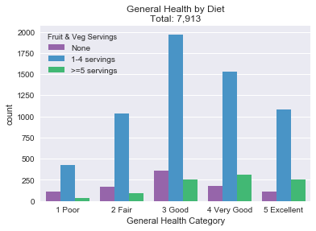
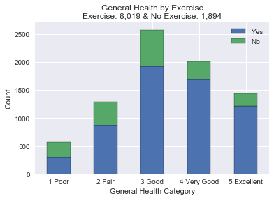
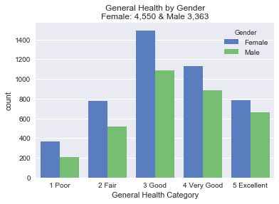
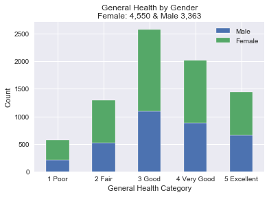
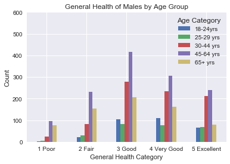
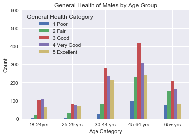
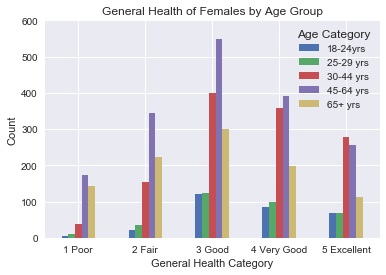
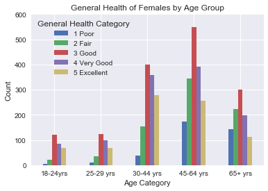

```python
# Import dependencies
import numpy as np
import pandas as pd
import matplotlib.pyplot as plt
import seaborn as sns
```


```python
data_csv = "clean_data.csv"
data_df = pd.read_csv(data_csv)
data_df.head()
```


<div>
<style scoped>
    .dataframe tbody tr th:only-of-type {
        vertical-align: middle;
    }

    .dataframe tbody tr th {
        vertical-align: top;
    }

    .dataframe thead th {
        text-align: right;
    }
</style>
<table border="1" class="dataframe">
  <thead>
    <tr style="text-align: right;">
      <th></th>
      <th>Unnamed: 0</th>
      <th>General Health</th>
      <th>(%) of Population Under FPL</th>
      <th>Eaten Fruits or Veggies Yesterday</th>
      <th>Age Group</th>
      <th>Race</th>
      <th>Education</th>
      <th>Insured</th>
      <th>Exercise</th>
      <th>Sex</th>
      <th>Drinker</th>
      <th>Smoker</th>
    </tr>
  </thead>
  <tbody>
    <tr>
      <th>0</th>
      <td>0</td>
      <td>4.0</td>
      <td>2.0</td>
      <td>2.0</td>
      <td>4.0</td>
      <td>2</td>
      <td>3.0</td>
      <td>1.0</td>
      <td>1.0</td>
      <td>0</td>
      <td>0.0</td>
      <td>0.0</td>
    </tr>
    <tr>
      <th>1</th>
      <td>1</td>
      <td>4.0</td>
      <td>3.0</td>
      <td>2.0</td>
      <td>2.0</td>
      <td>4</td>
      <td>2.0</td>
      <td>1.0</td>
      <td>1.0</td>
      <td>0</td>
      <td>0.0</td>
      <td>0.0</td>
    </tr>
    <tr>
      <th>2</th>
      <td>2</td>
      <td>4.0</td>
      <td>2.0</td>
      <td>1.0</td>
      <td>5.0</td>
      <td>1</td>
      <td>4.0</td>
      <td>1.0</td>
      <td>1.0</td>
      <td>1</td>
      <td>1.0</td>
      <td>1.0</td>
    </tr>
    <tr>
      <th>3</th>
      <td>4</td>
      <td>2.0</td>
      <td>1.0</td>
      <td>2.0</td>
      <td>5.0</td>
      <td>1</td>
      <td>2.0</td>
      <td>1.0</td>
      <td>1.0</td>
      <td>0</td>
      <td>0.0</td>
      <td>0.0</td>
    </tr>
    <tr>
      <th>4</th>
      <td>5</td>
      <td>3.0</td>
      <td>1.0</td>
      <td>2.0</td>
      <td>4.0</td>
      <td>1</td>
      <td>4.0</td>
      <td>1.0</td>
      <td>1.0</td>
      <td>0</td>
      <td>1.0</td>
      <td>1.0</td>
    </tr>
  </tbody>
</table>
</div>


```python
data_df['General Health'].value_counts()

# Labels for values
data_df["General Health Category"] = data_df["General Health"].map(lambda x: 
                                                 "1 Poor" if x == 1 else 
                                                 ("2 Fair" if x == 2 else
                                                  ("3 Good" if x == 3 else
                                                   ("4 Very Good" if x == 4 else
                                                    ( "5 Excellent")))))

data_df["Fruit & Veg Servings"] = data_df["Eaten Fruits or Veggies Yesterday"].map(lambda x: 
                                                 "None" if x == 1 else 
                                                 ("1-4 servings" if x == 2 else
                                                  (">=5 servings")))

data_df["Exercise Y/N"] = data_df["Exercise"].map(lambda x: "No" if x == 0 else "Yes")

data_df["Gender"] = data_df["Sex"].map(lambda x: "Female" if x == 0 else "Male")

data_df["Age Category"] = data_df["Age Group"].map(lambda x: 
                                                 "18-24yrs" if x == 1 else 
                                                 ("25-29 yrs" if x == 2 else
                                                  ("30-44 yrs" if x == 3 else
                                                   ("45-64 yrs" if x == 4 else
                                                    ("65+ yrs")))))

data_df = data_df.sort_values('General Health',ascending=True)
data_df.head()
```


<div>
<style scoped>
    .dataframe tbody tr th:only-of-type {
        vertical-align: middle;
    }

    .dataframe tbody tr th {
        vertical-align: top;
    }

    .dataframe thead th {
        text-align: right;
    }
</style>
<table border="1" class="dataframe">
  <thead>
    <tr style="text-align: right;">
      <th></th>
      <th>Unnamed: 0</th>
      <th>General Health</th>
      <th>(%) of Population Under FPL</th>
      <th>Eaten Fruits or Veggies Yesterday</th>
      <th>Age Group</th>
      <th>Race</th>
      <th>Education</th>
      <th>Insured</th>
      <th>Exercise</th>
      <th>Sex</th>
      <th>Drinker</th>
      <th>Smoker</th>
      <th>General Health Category</th>
      <th>Fruit &amp; Veg Servings</th>
      <th>Exercise Y/N</th>
      <th>Gender</th>
      <th>Age Category</th>
    </tr>
  </thead>
  <tbody>
    <tr>
      <th>5148</th>
      <td>5585</td>
      <td>1.0</td>
      <td>3.0</td>
      <td>2.0</td>
      <td>3.0</td>
      <td>3</td>
      <td>1.0</td>
      <td>1.0</td>
      <td>1.0</td>
      <td>0</td>
      <td>1.0</td>
      <td>1.0</td>
      <td>1 Poor</td>
      <td>1-4 servings</td>
      <td>Yes</td>
      <td>Female</td>
      <td>30-44 yrs</td>
    </tr>
    <tr>
      <th>6186</th>
      <td>6757</td>
      <td>1.0</td>
      <td>3.0</td>
      <td>2.0</td>
      <td>5.0</td>
      <td>3</td>
      <td>1.0</td>
      <td>1.0</td>
      <td>1.0</td>
      <td>0</td>
      <td>0.0</td>
      <td>0.0</td>
      <td>1 Poor</td>
      <td>1-4 servings</td>
      <td>Yes</td>
      <td>Female</td>
      <td>65+ yrs</td>
    </tr>
    <tr>
      <th>771</th>
      <td>821</td>
      <td>1.0</td>
      <td>2.0</td>
      <td>2.0</td>
      <td>5.0</td>
      <td>1</td>
      <td>2.0</td>
      <td>1.0</td>
      <td>0.0</td>
      <td>1</td>
      <td>1.0</td>
      <td>1.0</td>
      <td>1 Poor</td>
      <td>1-4 servings</td>
      <td>No</td>
      <td>Male</td>
      <td>65+ yrs</td>
    </tr>
    <tr>
      <th>3217</th>
      <td>3455</td>
      <td>1.0</td>
      <td>3.0</td>
      <td>2.0</td>
      <td>4.0</td>
      <td>3</td>
      <td>2.0</td>
      <td>1.0</td>
      <td>0.0</td>
      <td>0</td>
      <td>0.0</td>
      <td>0.0</td>
      <td>1 Poor</td>
      <td>1-4 servings</td>
      <td>No</td>
      <td>Female</td>
      <td>45-64 yrs</td>
    </tr>
    <tr>
      <th>6198</th>
      <td>6771</td>
      <td>1.0</td>
      <td>3.0</td>
      <td>2.0</td>
      <td>5.0</td>
      <td>3</td>
      <td>2.0</td>
      <td>1.0</td>
      <td>0.0</td>
      <td>1</td>
      <td>0.0</td>
      <td>0.0</td>
      <td>1 Poor</td>
      <td>1-4 servings</td>
      <td>No</td>
      <td>Male</td>
      <td>65+ yrs</td>
    </tr>
  </tbody>
</table>
</div>


```python
gender_count = data_df["Gender"].value_counts()
print(gender_count)
diet_count = data_df["Fruit & Veg Servings"].count()
print(diet_count)
workout_count = data_df["Exercise Y/N"].value_counts()
print(workout_count)
age_count = data_df["Age Category"].value_counts()
print(age_count)
```

    Female    4550
    Male      3363
    Name: Gender, dtype: int64
    7913
    Yes    6019
    No     1894
    Name: Exercise Y/N, dtype: int64
    45-64 yrs    2998
    30-44 yrs    2061
    65+ yrs      1651
    18-24yrs      606
    25-29 yrs     597
    Name: Age Category, dtype: int64
    


```python
sns.set(style="darkgrid")
flatui = ["#9b59b6", "#3498db","#2ecc71"]
sns.countplot(x="General Health Category", hue="Fruit & Veg Servings",data=data_df,palette=flatui,hue_order=["None","1-4 servings",">=5 servings"]).set_title("General Health by Diet\nTotal: 7,913")
plt.savefig("fruitveggie.png")
```





```python
grouped_gender = data_df.groupby(['General Health Category','Exercise Y/N'])['General Health Category'].count().unstack('Exercise Y/N')
grouped_gender[['Yes','No']].plot(kind='bar',edgecolor="black",stacked=True)

plt.ylabel("Count")
plt.title("General Health by Exercise\nExercise: 6,019 & No Exercise: 1,894")
plt.legend (loc = "upper right")
plt.xticks(rotation=0)
plt.show()
plt.savefig("exercisestack.png")
```





    <matplotlib.figure.Figure at 0x2422f45d3c8>


```python
sns.countplot(x="General Health Category", hue="Exercise Y/N", data=data_df).set_title("General Health by Exercise\nExercise: 6,019 & No Exercise: 1,894")
plt.savefig("exercisesbs.png")
```





```python
bars = ("Excellent","Very Good","Good","Fair","Poor")

grouped_gender = data_df.groupby(['General Health Category','Gender'])['General Health Category'].count().unstack('Gender')
grouped_gender[['Male','Female']].plot(kind='bar',edgecolor="white",stacked=True)
                                                        
plt.ylabel("Count")
plt.title("General Health by Gender\nFemale: 4,550 & Male 3,363")
plt.legend (loc = "upper right")
plt.xticks(rotation=0)
plt.show()
plt.savefig("genderstack.png")
```





    <matplotlib.figure.Figure at 0x2422f5a1b38>


```python
sns.countplot(x="General Health Category", hue="Gender",palette="muted", data=data_df).set_title("General Health by Gender\nFemale: 4,550 & Male 3,363")
plt.savefig("gendersbs.png")
```


```python
#Create a dataframe for each sex
male = data_df[data_df["Sex"] == 1]
female = data_df[data_df["Sex"] == 0]
```


```python
m_count = male["Age Category"].value_counts()
print(m_count)
f_count = female["Age Category"].value_counts()
print(f_count)
```

    45-64 yrs    1288
    30-44 yrs     833
    65+ yrs       675
    18-24yrs      305
    25-29 yrs     262
    Name: Age Category, dtype: int64
    45-64 yrs    1710
    30-44 yrs    1228
    65+ yrs       976
    25-29 yrs     335
    18-24yrs      301
    Name: Age Category, dtype: int64
    


```python
m_count = male["Gender"].value_counts()
print(m_count)
f_count = female["Gender"].value_counts()
print(f_count)
```

    Male    3363
    Name: Gender, dtype: int64
    Female    4550
    Name: Gender, dtype: int64
    


```python
#General Health of Males by Age Group
group_male = male.groupby(['General Health Category','Age Category'])['General Health Category'].count().unstack('Age Category')
group_male[['18-24yrs','25-29 yrs','30-44 yrs','45-64 yrs','65+ yrs']].plot(kind="bar")

plt.ylabel("Count")
plt.title("General Health of Males by Age Group")
plt.xticks(rotation=0)
plt.ylim(0,600)
plt.savefig("malesbyage.png")
plt.show()
```





```python
#General Health of Males by Age Group
group_male = male.groupby(['Age Category','General Health Category'])['Age Category'].count().unstack('General Health Category')
group_male[['1 Poor','2 Fair','3 Good','4 Very Good','5 Excellent']].plot(kind="bar")

plt.ylabel("Count")
plt.title("General Health of Males by Age Group")
plt.xticks(rotation=0)
plt.ylim(0,600)
plt.savefig("malesbyage2.png")
plt.show()
```





```python
#General Health of Females by Age Group

group_female = female.groupby(['General Health Category','Age Category'])['General Health Category'].count().unstack('Age Category')
group_female[['18-24yrs','25-29 yrs','30-44 yrs','45-64 yrs','65+ yrs']].plot(kind="bar")

plt.ylabel("Count")
plt.title("General Health of Females by Age Group")
plt.xticks(rotation=0)
plt.ylim(0,600)
plt.savefig("femalebyage.png")
plt.show()
```





```python
#General Health of Females by Age Group
group_female = female.groupby(['Age Category','General Health Category'])['Age Category'].count().unstack('General Health Category')
group_female[['1 Poor','2 Fair','3 Good','4 Very Good','5 Excellent']].plot(kind="bar")
#group_female = female.groupby(['Age Category'])

plt.ylabel("Count")
plt.title("General Health of Females by Age Group")
plt.xticks(rotation=0)
plt.ylim(0,600)
plt.savefig("femalebyage2.png")
plt.show()
```




