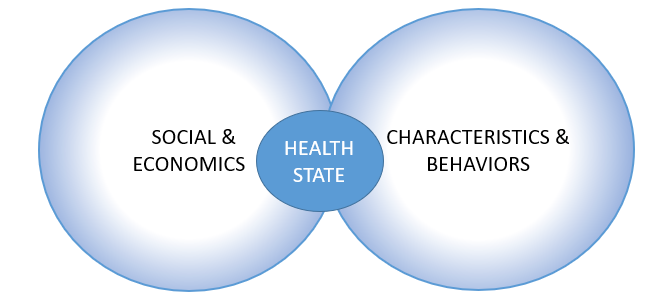

<<<<<<< HEAD

=======
>>>>>>> 829a4b3b37144f1ab23f288c6ad077cc6531dae5
# The Good, the Bad, & the Ugly of New York Health

## Team Members
* Toni Anderson
* Alex Schackmuth
* Mieae Yun

## Research Questions to Answer
### How does environmental & lifestyle influence health state?

## Project Description/Outline

#### Examining the influences of social & economics and characteristics & behaviors.  
#### The dependant variable is health state, and the values are excellent, very good, good, fair, & poor,
#### Controlling for age, sex, and race. 

## Data Sets to be Used
#### 2013 Community Health Survey

## Rough Breakdown of Tasks
