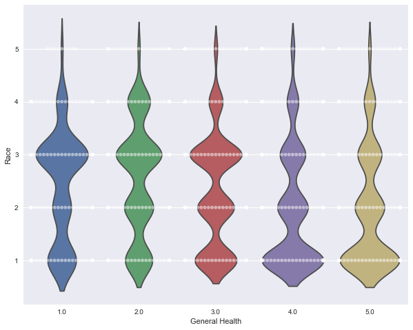
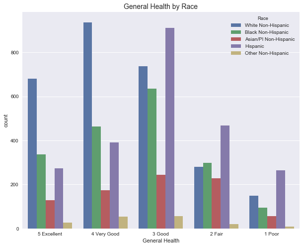
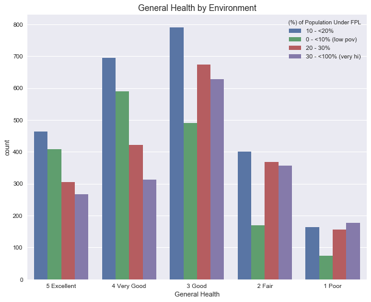
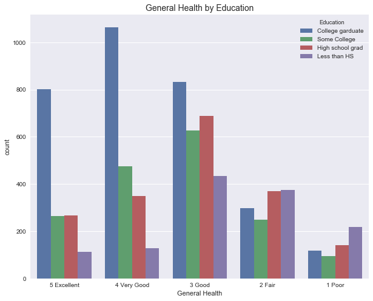

```python
import matplotlib.pyplot as plt
import seaborn as sns
import pandas as pd
import numpy as np
import os
import scipy.stats as stats
```


```python
clean_csv = os.path.join("data", "clean_data.csv")
data_df = pd.read_csv(clean_csv)
data_df.head()
```


<div>
<style scoped>
    .dataframe tbody tr th:only-of-type {
        vertical-align: middle;
    }

    .dataframe tbody tr th {
        vertical-align: top;
    }

    .dataframe thead th {
        text-align: right;
    }
</style>
<table border="1" class="dataframe">
  <thead>
    <tr style="text-align: right;">
      <th></th>
      <th>Unnamed: 0</th>
      <th>General Health</th>
      <th>(%) of Population Under FPL</th>
      <th>Eaten Fruits or Veggies Yesterday</th>
      <th>Age Group</th>
      <th>Race</th>
      <th>Education</th>
      <th>Insured</th>
      <th>Exercise</th>
      <th>Sex</th>
      <th>Drinker</th>
      <th>Smoker</th>
    </tr>
  </thead>
  <tbody>
    <tr>
      <th>0</th>
      <td>0</td>
      <td>4.0</td>
      <td>2.0</td>
      <td>2.0</td>
      <td>4.0</td>
      <td>2</td>
      <td>3.0</td>
      <td>1.0</td>
      <td>1.0</td>
      <td>0</td>
      <td>0.0</td>
      <td>0.0</td>
    </tr>
    <tr>
      <th>1</th>
      <td>1</td>
      <td>4.0</td>
      <td>3.0</td>
      <td>2.0</td>
      <td>2.0</td>
      <td>4</td>
      <td>2.0</td>
      <td>1.0</td>
      <td>1.0</td>
      <td>0</td>
      <td>0.0</td>
      <td>0.0</td>
    </tr>
    <tr>
      <th>2</th>
      <td>2</td>
      <td>4.0</td>
      <td>2.0</td>
      <td>1.0</td>
      <td>5.0</td>
      <td>1</td>
      <td>4.0</td>
      <td>1.0</td>
      <td>1.0</td>
      <td>1</td>
      <td>1.0</td>
      <td>1.0</td>
    </tr>
    <tr>
      <th>3</th>
      <td>4</td>
      <td>2.0</td>
      <td>1.0</td>
      <td>2.0</td>
      <td>5.0</td>
      <td>1</td>
      <td>2.0</td>
      <td>1.0</td>
      <td>1.0</td>
      <td>0</td>
      <td>0.0</td>
      <td>0.0</td>
    </tr>
    <tr>
      <th>4</th>
      <td>5</td>
      <td>3.0</td>
      <td>1.0</td>
      <td>2.0</td>
      <td>4.0</td>
      <td>1</td>
      <td>4.0</td>
      <td>1.0</td>
      <td>1.0</td>
      <td>0</td>
      <td>1.0</td>
      <td>1.0</td>
    </tr>
  </tbody>
</table>
</div>


```python
# Labels for numerical values
x_labels = {"General Health": {1: "Poor", 2 : "Fair", 3 : "Good", 4 : "Very Good", 5 : "Excellent"}}
education_labels = {"Education": {1 : "Less than HS", 2: "High school grad", 3: "Some College", 4: "College garduate", 5: "Don't know", 6: "Refused"}}
neighpov_labels = {"(%) of Population Under FPL": {1: "0 - <10% (low pov)", 2: "10 - <20%", 3: "20 - 30%", 4: "30 - <100% (very hi)"}}
race_labels = {"Race": {1:"White Non-Hispanic",2:"Black Non-Hispanic",3:"Hispanic",4:"Asian/PI Non-Hispanic",5:"Other Non-Hispanic"}}
```


```python
# Labels for values
data_df["General Health"] = data_df["General Health"].map(lambda x:
                                                "1 Poor" if x == 1 else
                                                ("2 Fair" if x == 2 else
                                                 ("3 Good" if x == 3 else
                                                  ("4 Very Good" if x == 4 else
                                                   ( "5 Excellent")))))

data_df = data_df.sort_values('General Health',ascending=False)

data_df.head()
```


<div>
<style scoped>
    .dataframe tbody tr th:only-of-type {
        vertical-align: middle;
    }

    .dataframe tbody tr th {
        vertical-align: top;
    }

    .dataframe thead th {
        text-align: right;
    }
</style>
<table border="1" class="dataframe">
  <thead>
    <tr style="text-align: right;">
      <th></th>
      <th>Unnamed: 0</th>
      <th>General Health</th>
      <th>(%) of Population Under FPL</th>
      <th>Eaten Fruits or Veggies Yesterday</th>
      <th>Age Group</th>
      <th>Race</th>
      <th>Education</th>
      <th>Insured</th>
      <th>Exercise</th>
      <th>Sex</th>
      <th>Drinker</th>
      <th>Smoker</th>
    </tr>
  </thead>
  <tbody>
    <tr>
      <th>3956</th>
      <td>4245</td>
      <td>5 Excellent</td>
      <td>2.0</td>
      <td>1.0</td>
      <td>2.0</td>
      <td>1</td>
      <td>4.0</td>
      <td>1.0</td>
      <td>1.0</td>
      <td>1</td>
      <td>1.0</td>
      <td>1.0</td>
    </tr>
    <tr>
      <th>5728</th>
      <td>6237</td>
      <td>5 Excellent</td>
      <td>1.0</td>
      <td>2.0</td>
      <td>4.0</td>
      <td>1</td>
      <td>4.0</td>
      <td>1.0</td>
      <td>1.0</td>
      <td>1</td>
      <td>1.0</td>
      <td>1.0</td>
    </tr>
    <tr>
      <th>1186</th>
      <td>1260</td>
      <td>5 Excellent</td>
      <td>3.0</td>
      <td>2.0</td>
      <td>5.0</td>
      <td>1</td>
      <td>3.0</td>
      <td>1.0</td>
      <td>1.0</td>
      <td>1</td>
      <td>1.0</td>
      <td>1.0</td>
    </tr>
    <tr>
      <th>3819</th>
      <td>4095</td>
      <td>5 Excellent</td>
      <td>3.0</td>
      <td>3.0</td>
      <td>4.0</td>
      <td>2</td>
      <td>4.0</td>
      <td>1.0</td>
      <td>1.0</td>
      <td>0</td>
      <td>0.0</td>
      <td>0.0</td>
    </tr>
    <tr>
      <th>3813</th>
      <td>4089</td>
      <td>5 Excellent</td>
      <td>3.0</td>
      <td>2.0</td>
      <td>5.0</td>
      <td>2</td>
      <td>2.0</td>
      <td>1.0</td>
      <td>1.0</td>
      <td>1</td>
      <td>0.0</td>
      <td>0.0</td>
    </tr>
  </tbody>
</table>
</div>


```python
#Attach labels for plotting
plot_df = data_df.replace(x_labels, inplace=True)
plot_df = data_df.replace(education_labels, inplace=True)
plot_df = data_df.replace(neighpov_labels, inplace=True)
plot_df = data_df.replace(race_labels, inplace=True)
```


```python
total_general_health = data_df.groupby(['General Health']).count()['Race']
total_general_health

#Assign colors
colors= ['darkred', 'gold', 'purple', 'blue', 'green']

total_race_chart = total_general_health.plot(kind='pie', figsize=(8,8), shadow=False, autopct="%1.1f%%", pctdistance=0.6, colors=colors, startangle=180, wedgeprops = {'linewidth': 10, 'edgecolor': 'white'})
total_race_chart.set_title("% of Total General Health of NY", fontsize=18)
plt.axis('equal')
plt.ylabel("")

my_circle=plt.Circle( (0,0), 0.7, color='white')
p=plt.gcf()
p.gca().add_artist(my_circle)

plt.savefig("% of Total General Health")
plt.show()

```





## General Health by Race


```python
plt.figure(figsize=(10,8))
sns.set()
sns.countplot(x="General Health", hue="Race", data=data_df)
plt.title('General Health by Race', fontsize=14)

plt.savefig("General Health by Race")
```





## General Health by Environment


```python
plt.figure(figsize=(10,8))
sns.set()
sns.countplot(x="General Health", hue="(%) of Population Under FPL", data=data_df)
plt.title('General Health by Environment',fontsize=14)

plt.savefig("General Health by Environment")
```





## General Health by Education


```python
plt.figure(figsize=(10,8))
sns.set()
sns.countplot(x="General Health", hue="Education", data=data_df)
plt.title('General Health by Education', fontsize=14)

plt.savefig("General Health by Education")
```




