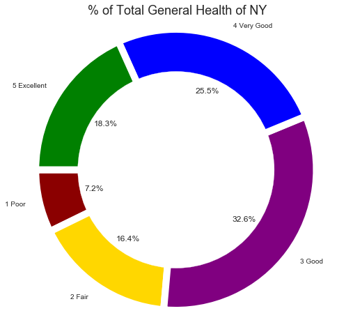

```python
import matplotlib.pyplot as plt
import seaborn as sns
import pandas as pd
import numpy as np
import os
import scipy.stats as stats
```


```python
clean_csv = os.path.join("data", "clean_data.csv")
data_df = pd.read_csv(clean_csv)
data_df.head()
```


<div>
<style scoped>
    .dataframe tbody tr th:only-of-type {
        vertical-align: middle;
    }

    .dataframe tbody tr th {
        vertical-align: top;
    }

    .dataframe thead th {
        text-align: right;
    }
</style>
<table border="1" class="dataframe">
  <thead>
    <tr style="text-align: right;">
      <th></th>
      <th>Unnamed: 0</th>
      <th>General Health</th>
      <th>(%) of Population Under FPL</th>
      <th>Eaten Fruits or Veggies Yesterday</th>
      <th>Age Group</th>
      <th>Race</th>
      <th>Education</th>
      <th>Insured</th>
      <th>Exercise</th>
      <th>Sex</th>
    </tr>
  </thead>
  <tbody>
    <tr>
      <th>0</th>
      <td>0</td>
      <td>4.0</td>
      <td>2.0</td>
      <td>2.0</td>
      <td>4.0</td>
      <td>2</td>
      <td>3.0</td>
      <td>1.0</td>
      <td>1.0</td>
      <td>0</td>
    </tr>
    <tr>
      <th>1</th>
      <td>1</td>
      <td>4.0</td>
      <td>3.0</td>
      <td>2.0</td>
      <td>2.0</td>
      <td>4</td>
      <td>2.0</td>
      <td>1.0</td>
      <td>1.0</td>
      <td>0</td>
    </tr>
    <tr>
      <th>2</th>
      <td>2</td>
      <td>4.0</td>
      <td>2.0</td>
      <td>1.0</td>
      <td>5.0</td>
      <td>1</td>
      <td>4.0</td>
      <td>1.0</td>
      <td>1.0</td>
      <td>1</td>
    </tr>
    <tr>
      <th>3</th>
      <td>4</td>
      <td>2.0</td>
      <td>1.0</td>
      <td>2.0</td>
      <td>5.0</td>
      <td>1</td>
      <td>2.0</td>
      <td>1.0</td>
      <td>1.0</td>
      <td>0</td>
    </tr>
    <tr>
      <th>4</th>
      <td>5</td>
      <td>3.0</td>
      <td>1.0</td>
      <td>2.0</td>
      <td>4.0</td>
      <td>1</td>
      <td>4.0</td>
      <td>1.0</td>
      <td>1.0</td>
      <td>0</td>
    </tr>
  </tbody>
</table>
</div>


```python
# Labels for numerical values
x_labels = {"General Health": {1: "Poor", 2 : "Fair", 3 : "Good", 4 : "Very Good", 5 : "Excellent"}}
education_labels = {"Education": {1 : "Less than HS", 2: "High school grad", 3: "Some College", 4: "College garduate", 5: "Don't know", 6: "Refused"}}
neighpov_labels = {"(%) of Population Under FPL": {1: "0 - <10% (low pov)", 2: "10 - <20%", 3: "20 - 30%", 4: "30 - <100% (very hi)"}}
race_labels = {"Race": {1:"White Non-Hispanic",2:"Black Non-Hispanic",3:"Hispanic",4:"Asian/PI Non-Hispanic",5:"Other Non-Hispanic"}}
```

## Examples of General Health by Race


```python
plt.figure(figsize=(10,8))
sns.barplot(x="General Health", y="Race", data=data_df);
```


```python
plt.figure(figsize=(10,8))
sns.set()
sns.violinplot(x="General Health", y="Race", data=data_df, inner=None)
sns.swarmplot(x="General Health", y="Race", data=data_df, color="w", alpha=.5);
```





```python
sns.set(style="whitegrid")

# Initialize the matplotlib figure
f, ax = plt.subplots(figsize=(6, 15))

# Plot the total crashes
sns.set_color_codes("pastel")
sns.barplot(x="General Health", y="Race", data=data_df,
            label="Race", color="b")

# Plot the crashes where alcohol was involved
sns.set_color_codes("muted")
sns.barplot(x="General Health", y="Sex", data=data_df,
            label="Sex", color="b")

# Add a legend and informative axis label
ax.legend(ncol=1, loc="lower right", frameon=True)
ax.set(xlim=(-1, 6), ylabel="",
       xlabel="General Health")
sns.despine(left=True, bottom=True)
```


```python
#Attach labels for plotting
plot_df = data_df.replace(x_labels, inplace=True)
plot_df = data_df.replace(education_labels, inplace=True)
plot_df = data_df.replace(neighpov_labels, inplace=True)
plot_df = data_df.replace(race_labels, inplace=True)
```


```python
plt.figure(figsize=(10,8))
sns.set()
sns.countplot(x="General Health", hue="Race", data=data_df)
```


    <matplotlib.axes._subplots.AxesSubplot at 0x1d38c566748>


## Examples of General Health by Neighborhood


```python
plt.figure(figsize=(10,8))
sns.set()
sns.countplot(x="General Health", hue="(%) of Population Under FPL", data=data_df)
```


    <matplotlib.axes._subplots.AxesSubplot at 0x1d38e9a7198>


```python
plotdata_df = pd.read_csv(clean_csv)
plotdata_df.head()
plt.figure(figsize=(10,8))
sns.lvplot(x="General Health", y="(%) of Population Under FPL", data=plotdata_df)
```


    <matplotlib.axes._subplots.AxesSubplot at 0x1d38f02c668>


## Examples of General Health by Education


```python
plt.figure(figsize=(10,8))
sns.set()
sns.countplot(x="General Health", hue="Education", data=data_df)
```


    <matplotlib.axes._subplots.AxesSubplot at 0x1d390ca6358>


